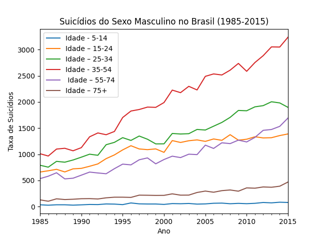
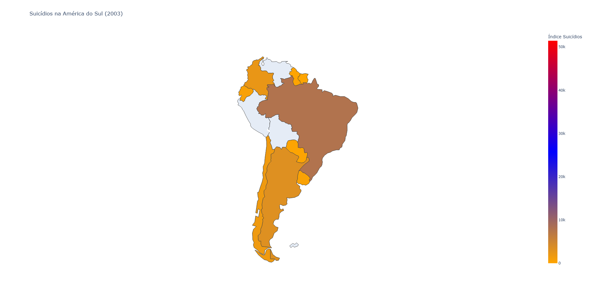
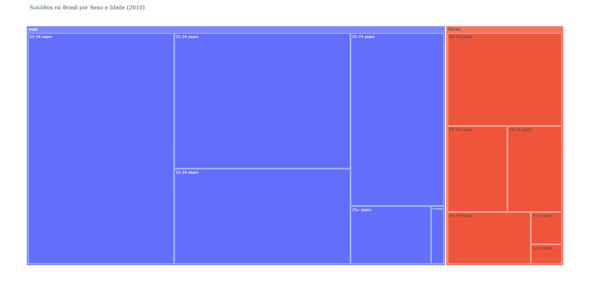

# 📊 Análise e Visualização de Dados em Python  

Este projeto tem como objetivo apresentar a **implementação em Python** da **visualização de informações** presentes em um dataset real, utilizando pelo menos **três técnicas** estudadas na disciplina.  

## 📌 Objetivos  

- Utilizar **dados reais** para análise.  
- Aplicar pelo menos **três técnicas de visualização** abordadas na disciplina.  
- Garantir que as **visualizações sejam coerentes e complementares**, apresentando diferentes perspectivas do mesmo dataset.  
- Selecionar no mínimo **uma técnica de cada uma das cinco unidades** estudadas na disciplina.  

## 📂 Estrutura do Projeto  

O projeto contém os seguintes arquivos e datasets utilizados para a visualização:  

```
📁 datasets
│-- 📄 BrazilSuicidiosIdadeMasc.csv  
│-- 📄 SouthAmericaSuicidios2003.csv  
│-- 📄 Brazil2010MascFemi.csv  
│-- 📄 master.csv  
```

## 📥 Download dos Arquivos  

Para executar o projeto corretamente, baixe os arquivos CSV necessários:  

- 📄 [BrazilSuicidiosIdadeMasc.csv](#)  
- 📄 [SouthAmericaSuicidios2003.csv](#)  
- 📄 [Brazil2010MascFemi.csv](#)  

## 📊 Técnicas de Visualização Utilizadas  

Este projeto utiliza **três diferentes bibliotecas** para a visualização de dados:  

1. **Matplotlib** - Gráfico de linha para representar a evolução da taxa de suicídios masculinos no Brasil (1985-2015).  
2. **Plotly (Graph Objects)** - Mapa de coroplétio mostrando a distribuição de suicídios na América do Sul em 2003.  
3. **Plotly Express** - Gráfico do tipo **TreeMap**, ilustrando a distribuição de suicídios no Brasil em 2010 por **sexo e idade**.  

## ▶️ Como Executar  

### **1️⃣ Instale as Dependências**  

Certifique-se de ter o **Python** instalado e execute o seguinte comando para instalar as bibliotecas necessárias:  

```sh
pip install matplotlib pandas plotly
```

### **2️⃣ Execute o Código**  

Coloque os arquivos **CSV** na mesma pasta do script e execute o **main.py** com:  

```sh
python main.py
```

### **3️⃣ Interpretação das Saídas**  

- Um gráfico de linha será exibido mostrando a evolução dos suicídios masculinos no Brasil.  

<p align="center">
  
</p>

- Um mapa interativo será gerado e salvo como um arquivo `.html`, mostrando a distribuição de suicídios na América do Sul em 2003.  

<p align="center">
  
</p>

- Um gráfico **TreeMap** será gerado e salvo como um arquivo `.html`, ilustrando a proporção de suicídios no Brasil por sexo e idade no ano de 2010.

<p align="center">
  
</p>

## 📌 Conclusão  

Este projeto explora diferentes formas de visualização de dados para apresentar insights sobre os índices de suicídio em diferentes regiões e períodos.  

---
📌 **Observação:** Este projeto foi desenvolvido para fins acadêmicos.
